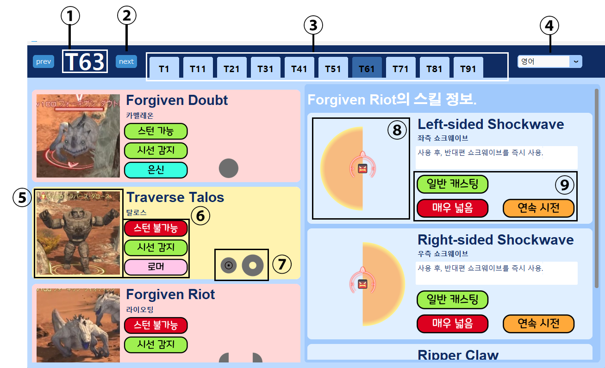

# TraverseNote
황금의 유산 딥던전에 등장하는 몹들을 정리해둔 프로그램입니다.

## 기능 및 사용법

 
1. 현재 층. 
2. 층 이동하기. next를 눌러 현재 층을 올릴 수 있습니다. 
3. 빠른 층 이동. 층 수를 눌러 빠르게 층을 이동할 수 있습니다. 
4. 언어를 바꿀 수 있습니다. (영어, 일본어) 일본어는 아직 몇몇 부분이 영어입니다. 
5. 몹의 이미지. 
6. 몹의 속성. 스턴 여부, 어그로 유형, 로머인지 확인할 수 있습니다. 
7. 몹이 사용하는 스킬의 범위를 간략하게 아이콘으로 보여줍니다. 
8. 해당 몹이 현재 층에 새로 등장하는 몹일 경우, 아이콘으로 표시해줍니다. 
9. 왼쪽의 몹 리스트 하나를 클릭하면, 몹이 사용하는 스킬들을 더 자세하게 보여줍니다. 
부채꼴 공격의 경우 각도가 다를 수 있지만, 대부분의 경우 몹의 양 옆에 서면 안전합니다. 
10.몹이 사용하는 스킬의 속성을 알려줍니다. (공격 범위, 즉발 or 캐스팅, 연계 공격 여부 등.) 
 

### 몹의 위험도에 따라 목록에 색이 칠해집니다.
#### 색 없음: 쉬움. 아이콘으로만 공격 범위를 확인하고 움직여도 상관 없음.
#### 노란색: 주의. 위협적이지만, 기믹을 알고 주시하고 있다면 쉬운 적.
#### 빨간색: 위험. 기믹을 알고 있어도 방심할 수 없음. 2마리 이상이 뭉치면 당신을 1층으로 보낼수도 있음.
#### 위험도는 작성자의 체감 난이도와 트라우마...에 기반합니다.

## json editor
몹의 정보가 들어있는 Monsters.json파일의 수정을 간편하게 만들어주는 프로그램.
